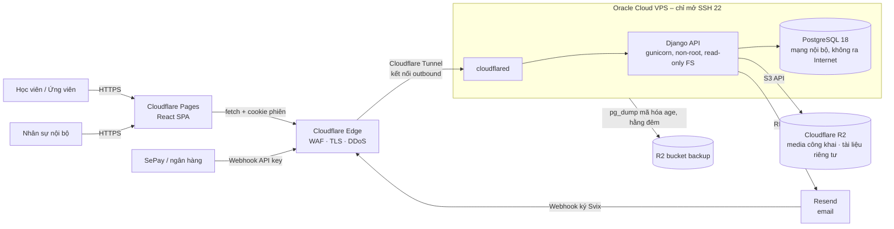
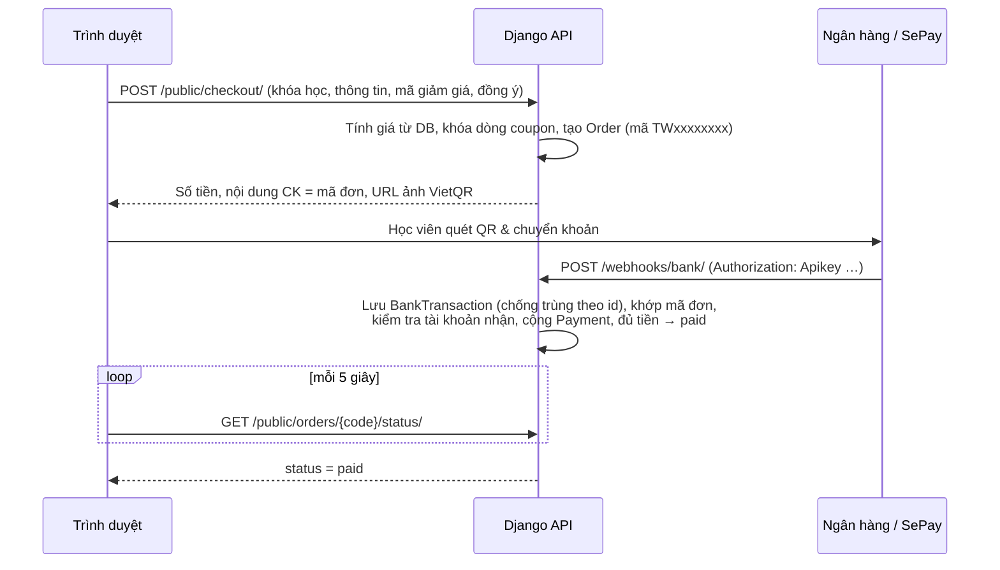

# Kiến trúc hệ thống TWings Academy

## 1. Tổng quan

| Thành phần | Công nghệ | Vị trí |
|---|---|---|
| Frontend | React 19, Vite 8, Tailwind 4 | `frontend/` → Cloudflare Pages |
| API | Django 5.2 LTS, DRF, gunicorn | `backend/` → Docker trên VPS |
| CSDL | PostgreSQL 18 | Docker volume trên VPS |
| File | Cloudflare R2 (django-storages) | 2 bucket: `twings-media` (công khai), `twings-private` |
| Email | Resend (gọi từ server) | – |
| Thanh toán | VietQR + webhook biến động số dư (định dạng SePay) | – |
| CI/CD | GitHub Actions, GHCR | `.github/workflows/` |

## 2. Backend – các app Django

| App | Trách nhiệm | Model chính |
|---|---|---|
| `core` | Middleware bảo mật, mã hóa trường, audit log, upload ảnh, health | `SiteConfig`, `AuditLog` |
| `accounts` | Tài khoản nhân sự, 5 vai trò, ma trận quyền | `User` |
| `catalog` | Khóa học, giảng viên, đối tác, lớp (cohort), mã giảm giá | `Course`, `Instructor`, `Partner`, `Cohort`, `Coupon` |
| `cms` | Bài viết SEO, banner trang chủ | `Article`, `HeroBanner` |
| `crm` | Lead/đơn đăng ký (6 nhóm thông tin), chiến dịch tuyển sinh, hoạt động, việc cần làm | `Order`, `AdmissionCampaign`, `CampaignPosition`, `Activity`, `FollowupTask` |
| `payments` | Mã VietQR, webhook ngân hàng, xác nhận thủ công | `BankTransaction`, `Payment` |
| `notifications` | Mẫu email, gửi qua Resend, webhook trạng thái | `EmailTemplate`, `EmailLog`, `EmailEvent` |

## 3. API

Tiền tố `/api/v1/`. JSON dùng camelCase (khớp kiểu dữ liệu TypeScript), ngày dạng `dd/mm/yyyy`.

| Nhóm | Đường dẫn | Xác thực |
|---|---|---|
| Sức khỏe | `GET health/` | Không |
| Đăng nhập | `GET auth/csrf/`, `POST auth/login/`, `POST auth/logout/`, `GET auth/me/` | Cookie phiên + CSRF |
| Công khai | `public/courses/`, `public/courses/{slug}/`, `public/articles/`, `public/banners/`, `public/instructors/`, `public/partners/`, `public/site-config/{key}/` | Không (chỉ đọc) |
| Form công khai | `POST public/registrations/`, `POST public/checkout/`, `GET public/orders/{code}/status/` | Không, giới hạn 10 lần/giờ/IP, có honeypot, bắt buộc đồng ý xử lý dữ liệu |
| Nội bộ | `staff/orders/`, `staff/orders/export/`, `staff/courses/`, `staff/cohorts/`, `staff/cohorts/{id}/rollover/`, `staff/articles/`, `staff/banners/`, `staff/site-config/{key}/`, `staff/users/`, `staff/transactions/`, `staff/orders/{id}/confirm-payment/`, `staff/email-templates/`, `staff/email-logs/`, `staff/emails/send/`, `staff/uploads/images/` … | Cookie phiên + CSRF + mã quyền RBAC |
| Webhook | `POST webhooks/bank/`, `POST webhooks/resend/` | API key / chữ ký Svix |

## 4. Luồng thanh toán VietQR

Trình duyệt không bao giờ gửi số tiền; mọi giá trị tiền đều đọc từ CSDL.

## 5. Phân quyền (RBAC)

Ma trận quyền nằm ở `backend/apps/accounts/rbac.py`, dùng đúng mã quyền của frontend (`frontend/src/utils/rbac.ts`). Frontend chỉ dùng ma trận để ẩn/hiện giao diện; **server là nơi quyết định**.

- Mỗi viewset khai báo `permission_map` theo từng action. Action nào không có trong map thì bị từ chối (mặc định đóng).
- Sửa đơn hàng được kiểm tra theo nhóm trường: trường thanh toán cần `finance.confirm_manual`, trường thưởng giới thiệu cần `finance.referral_bonus`, phân công PIC cần `crm.assign_pic`.
- Chỉ Super Admin mới gán được vai trò Super Admin; sửa quyền tùy chỉnh cần `rbac.edit_matrix`.

## 6. Dữ liệu cá nhân

| Dữ liệu | Cách lưu |
|---|---|
| CCCD, hộ khẩu, nơi ở, số tài khoản ngân hàng | Mã hóa Fernet (`EncryptedTextField`). CCCD có thêm blind index HMAC để phát hiện trùng |
| Họ tên, SĐT, email | Văn bản thường (cần tìm kiếm), chỉ API nội bộ có quyền mới đọc được |
| Đồng ý xử lý dữ liệu | `privacy_consent_at` và `privacy_consent_version` trên mỗi hồ sơ |
| File xuất CSV | Không chứa các trường đã mã hóa, chống chèn công thức Excel, có ghi audit log |

## 7. Định hướng tiếp theo

- Xác thực 2 lớp (TOTP) cho nhân sự, hoặc bảo vệ `/staff` và trang admin bằng Cloudflare Access.
- Chuyển gửi email/đối soát sang hàng đợi (Celery/RQ) khi lưu lượng tăng.
- Tách các component CMS lớn (`CMSCRMOrdersTab`, `CompAILeadDetailModal`…) và nối dần các tab CMS còn lại vào API. Hiện các tab đó vẫn thao tác trên dữ liệu trong trình duyệt.
- Thêm router (react-router) để mỗi khóa học và bài viết có URL riêng, phục vụ SEO.
