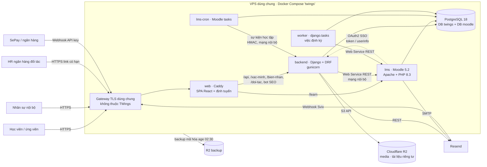
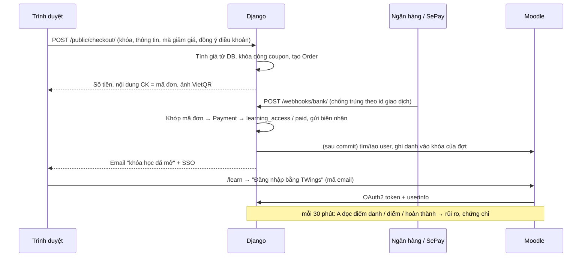
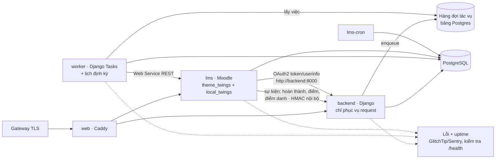

# Kiến trúc hệ thống TWings Academy

Cập nhật 07/10/2026. Tài liệu gồm hai phần: **hiện trạng** (mục 1–8, đúng như code đang chạy) và
**kiến trúc đề xuất** (mục 9–12: đánh giá, kiến trúc đích, lộ trình, quyết định kiến trúc).
Vận hành chi tiết xem [DEPLOYMENT.md](DEPLOYMENT.md). Moodle trong repo xem [LMS.md](LMS.md).

## 1. Bối cảnh và nguyên tắc

TWings Academy là nền tảng **tuyển sinh, đào tạo và giới thiệu việc làm** cho nhân sự ngân hàng. Hệ thống phục vụ
hành trình 10 khâu: tiếp thị, tư vấn, thanh toán, nhập học, học tập, tốt nghiệp, giới thiệu việc làm và theo dõi
sau tuyển dụng.

Ràng buộc chi phối thiết kế:

| Ràng buộc | Hệ quả |
|---|---|
| Một VPS ARM64 (6 GB RAM, CPU dùng chung) chạy cùng sản phẩm khác, sau một gateway TLS dùng chung | Mọi container có giới hạn RAM và CPU, không mở cổng ra host, không thêm hạ tầng (Redis, broker…) khi chưa thật cần |
| Repo công khai | Secret chỉ nằm trên VPS và trong GitHub Environment. Log CI không in dữ liệu nhạy cảm. gitleaks chạy trên toàn bộ lịch sử |
| Nhóm phát triển nhỏ | Một monorepo, một pipeline, một cơ sở dữ liệu. Dùng tính năng có sẵn (Moodle, Django) trước khi tự viết |
| Dữ liệu cá nhân và tiền học phí | Server quyết định mọi quyền và mọi số tiền. Mã hóa trường nhạy cảm. Có audit log |

Nguyên tắc:
1. **Mỗi loại dữ liệu có đúng một nơi gốc** (mục 5). Hệ thống khác chỉ đọc hoặc nhận bản sao một chiều.
2. **Moodle làm việc của LMS** (nội dung, học, kiểm tra, điểm danh, sổ điểm). **TWings làm phần còn lại**
   (con người, tiền, đợt học, chứng chỉ, việc làm).
3. **Hỏng một phần không kéo sập cả hệ thống**: Moodle lỗi không được làm hỏng thanh toán. Mọi bước đồng bộ
   đều idempotent và có thử lại.
4. **Mặc định đóng**: quyền không khai báo là bị từ chối. Mạng nội bộ không ra Internet nếu không cần.

## 2. Kiến trúc hiện tại

| Thành phần | Công nghệ | Mã nguồn | Chạy ở |
|---|---|---|---|
| Website + CMS/CRM `/app` | React 19, TypeScript, Vite 8, Tailwind 4 | `frontend/` | Container `web` (Caddy). Bản sao tùy chọn trên Cloudflare Pages |
| API, trang Django, SSO | Django 6.1, DRF, gunicorn (2 worker × 4 thread) | `backend/` | Container `backend` (non-root, FS chỉ đọc) |
| Tác vụ nền | django.tasks + `django-tasks-db` (hàng đợi trong Postgres), lịch `apps/core/schedule.py` | `backend/` | Container `worker` (cùng image backend) |
| LMS | Moodle 5.2.4, PHP 8.3, Apache (tối đa 4 worker) + 3 plugin + `local_twings` + `theme_twings` | `lms/` | Container `lms`, `lms-cron` |
| CSDL | PostgreSQL 18 (DB `twings` và `moodle`, role riêng) | – | Container `db`, volume `pgdata` |
| File | R2 (2 bucket) hoặc volume `appdata`. File Moodle trong volume `moodledata` | – | – |
| Email | Resend (API từ Django, SMTP từ Moodle) | – | – |
| CI/CD | GitHub Actions → GHCR (amd64 + arm64) → SSH forced-command → `deploy.sh` | `.github/`, `infra/` | – |

**Mạng Docker** (cô lập theo nhu cầu):

| Mạng | Thành viên | Ra Internet |
|---|---|---|
| `gateway` (ngoài) | web | – (chỉ gateway gọi vào) |
| `app` (internal) | web, backend, lms | Không |
| `data` (internal) | backend, db, lms, lms-cron | Không |
| `egress` | backend, lms, lms-cron | Có (Resend, R2, gói ngôn ngữ Moodle) |

**Định tuyến theo đường dẫn** trên mọi tên miền của trang (một bản build chạy được trên mọi tên miền, không cần CORS,
cookie luôn là first-party):

| Đường dẫn | Đích |
|---|---|
| `/`, `/khoa-hoc/…`, `/tin-tuc/…`, `/learn/tai-khoan`, `/app/…` | SPA React. Bot xem trước link và bot tìm kiếm nhận HTML do Django render (`/_seo/…`) |
| `/api/v1/…` | Django API |
| `/xac-minh/…`, `/bien-nhan/…`, `/doi-tac/…`, `/sitemap.xml`, `/robots.txt` | Trang Django (chứng chỉ, biên nhận, trang cho HR đối tác) |
| `/learn/…` | Moodle. `/learn/webservice/*` trả 404 từ Internet |
| Tên miền `api-…` | Webhook (SePay, Resend), Django admin, `/media` khi không dùng R2 |

## 3. Mã nguồn (monorepo)

| Thư mục | Ngôn ngữ | Nội dung |
|---|---|---|
| `backend/` | Python | 9 app Django (mục 4), lệnh định kỳ, test (pytest) |
| `frontend/` | TypeScript | `storefront/` (website), `admin/` (CMS/CRM `/app`), `components/`, `lib/` |
| `lms/` | PHP | Moodle 5.2.4 + plugin bên thứ ba (git subtree) + `public/local/twings` (plugin TWings) |
| `infra/` | Shell, Caddyfile, PHP config | `caddy/`, `lms/` (Dockerfile, config, `vendor.py`, `patches.txt`), `vps/` (deploy, backup), `ops/`, `env/*.example` |
| `docs/` | Markdown | Kiến trúc, triển khai, LMS |

Python, PHP và TypeScript không gọi lẫn nhau trong cùng tiến trình. Chúng chỉ giao tiếp qua **hợp đồng HTTP**: REST API
của Django, Web Service của Moodle, OAuth2. Nhờ vậy mỗi phần build, test và nâng cấp độc lập.

## 4. Backend: các app Django

| App | Trách nhiệm | Model chính |
|---|---|---|
| `core` | Middleware bảo mật, mã hóa trường, audit log, upload, health | `SiteConfig`, `AuditLog` |
| `accounts` | Nhân sự, 5 vai trò, ma trận quyền | `User` |
| `catalog` | Khóa học, chương trình, đợt khai giảng, lịch học, giảng viên, đối tác, trả góp, mã giảm giá, đánh giá | `Course`, `Cohort`, `CohortSession`, `ProgramCourse`, `InstallmentPlan`, `Coupon`, `CourseReview` |
| `cms` | Bài viết, banner, SEO, trang pháp lý, đo lượt xem không cookie | `Article`, `HeroBanner`, `PageViewDaily` |
| `crm` | Lead và đơn, chiến dịch, hoạt động, việc cần làm, lịch hẹn, hóa đơn VAT, trả góp, giới thiệu việc làm, link đối tác | `Order`, `AdmissionCampaign`, `Activity`, `FollowupTask`, `Appointment`, `Installment`, `Placement`, `PartnerShare` |
| `payments` | VietQR, webhook ngân hàng, xác nhận thủ công, hoàn tiền, biên nhận | `BankTransaction`, `Payment`, `Refund` |
| `notifications` | Mẫu email, gửi qua Resend, trạng thái giao nhận, email theo hành trình | `EmailTemplate`, `EmailLog`, `EmailEvent` |
| `lms` | Ghi danh Moodle, đợt học thành khóa Moodle, đồng bộ tiến độ/chuyên cần/điểm, rủi ro, chứng chỉ | `LmsEnrollment`, `Certificate` |
| `sso` | Nhà cung cấp OAuth2 cho Moodle, đăng nhập bằng mã email, tài khoản học viên | – (cache) |

API: tiền tố `/api/v1/` với các nhóm `health/`, `auth/` (cookie phiên + CSRF), `public/` (chỉ đọc, form có giới hạn
tần suất và honeypot), `staff/` (cookie phiên + CSRF + mã quyền RBAC), `webhooks/` (API key, chữ ký Svix),
`sso/` (OAuth2). JSON dùng camelCase, ngày dạng `dd/mm/yyyy`.

## 5. Ranh giới TWings ↔ Moodle

| Dữ liệu | Nơi gốc | Chiều đồng bộ | Cơ chế hiện tại |
|---|---|---|---|
| Danh tính (học viên, nhân sự, giảng viên) | TWings | TWings → Moodle | Tạo tài khoản qua WS. Đăng nhập SSO OAuth2 (TWings là nhà cung cấp) |
| Khóa học bán, giá, đơn, thanh toán | TWings | – | – |
| Đợt khai giảng, lịch học | TWings | TWings → Moodle | Sao chép khóa mẫu (`core_course_duplicate_course`), sự kiện lịch, phiên điểm danh |
| Ghi danh | TWings (đơn có quyền học) | TWings → Moodle | `enrol_manual_*` sau khi giao dịch DB commit. Lỗi thì cron thử lại mỗi 10 phút |
| Nội dung, bài kiểm tra, ngân hàng đề | Moodle | Moodle → web (chỉ tên chương) | Đề cương công khai qua `core_course_get_contents` |
| Điểm danh, điểm, hoàn thành | Moodle | Moodle → TWings | Đọc định kỳ mỗi 30 phút (`sync_lms_completion`) |
| Chứng chỉ, rủi ro học tập, việc làm | TWings | – | Tính từ dữ liệu đã đồng bộ |

Kênh tích hợp: (1) **Web Service REST**: backend gọi `http://lms:8080/learn` trên mạng nội bộ, token chỉ dùng được
từ IP nội bộ, vai trò quyền tối thiểu (`twings_setup.php`). (2) **OAuth2**: Moodle đổi mã lấy token qua tên miền công
khai. (3) **Sự kiện** Moodle → TWings (`local_twings`, mục 10.2) và **đối soát định kỳ** trong `worker`.

## 6. Luồng chính

Trình duyệt không bao giờ gửi số tiền. Mọi giá trị tiền đều đọc từ CSDL.

| Khâu | Module |
|---|---|
| 1 Tiếp thị | `cms` (SEO, bot prerender), nguồn khách UTM → `Order.attribution`, `PageViewDaily` |
| 2 Đợt khai giảng | `catalog.Cohort`, `refresh_intakes`, khóa Moodle riêng cho mỗi đợt |
| 3–4 Tư vấn | `crm` (giao lead, hạn phản hồi, lịch hẹn, việc cần làm) |
| 5 Thanh toán | `payments` (VietQR, trả góp, hoàn tiền, biên nhận, hóa đơn VAT) |
| 6 Nhập học | hồ sơ nhập học + CV (bucket riêng tư), danh sách lớp |
| 7–8 Học tập, tốt nghiệp | `lms` (điểm danh mod_attendance, sổ điểm, rủi ro, quy tắc chuyên cần, chứng chỉ `TWC-…`) |
| 9–10 Việc làm | `crm.Placement`, link `/doi-tac/<token>` cho HR, mốc thử việc và cam kết |

**Tác vụ định kỳ** (container `worker`, lịch trong `backend/apps/core/schedule.py`, giờ Việt Nam):
`sync_lms_enrollments` (10 phút), `sync_lms_completion` (30 phút), `refresh_intakes` (00:15), `remind_installments`
(09:00), `run_journeys` (09:30), `remind_appointments` (mỗi giờ 7–21h), `prune_db_task_results` (03:30). Chỉ còn
`backup.sh` (02:30) là cron của host (cần Docker). Moodle có cron riêng trong `lms-cron`.

## 7. Phân quyền

- Ma trận quyền ở `backend/apps/accounts/rbac.py`, dùng chung mã quyền với frontend (`frontend/src/utils/rbac.ts`).
  Frontend chỉ ẩn hoặc hiện giao diện; **server quyết định**.
- 5 vai trò: Quản trị tối cao, Biên tập nội dung & SEO, Tư vấn tuyển sinh & CRM, Vận hành đào tạo & LMS,
  Kế toán & tài chính.
- Mỗi viewset khai báo `permission_map` theo action. Action không có trong map bị từ chối. Sửa đơn được kiểm tra theo
  nhóm trường (thanh toán, thưởng giới thiệu, phân công PIC).
- Moodle: nhân sự Đào tạo được gán vai trò *manager*, giảng viên là *editing teacher* của khóa đợt, học viên là
  *student*. Tài khoản tích hợp `twings_ws` chỉ dùng được qua Web Service.

## 8. Dữ liệu cá nhân và bảo mật

| Dữ liệu | Cách lưu |
|---|---|
| CCCD, hộ khẩu, nơi ở, số tài khoản ngân hàng | Mã hóa Fernet (`EncryptedTextField`). CCCD có blind index HMAC để phát hiện trùng |
| Họ tên, SĐT, email | Văn bản thường (cần tìm kiếm). Chỉ API nội bộ có quyền mới đọc được |
| Đồng ý xử lý dữ liệu, đồng ý điều khoản | Thời điểm và phiên bản trên hồ sơ. Moodle dùng cùng chính sách làm *site policy* |
| CV, hồ sơ nhập học | Bucket R2 riêng tư, link ký có hạn 5 phút |
| File CSV xuất ra | Không chứa trường mã hóa, chống chèn công thức, có audit log |
| Backup | `pg_dump` (2 DB) + `moodledata`, mã hóa `age`, lên R2 |

Container chạy non-root, `no-new-privileges`, `cap_drop: ALL`, FS chỉ đọc (trừ volume dữ liệu). Image ghim theo digest.
CI không dùng secret với PR.

## 9. Đánh giá kiến trúc hiện tại

**Điểm mạnh:** ranh giới rõ giữa thương mại (Django) và học tập (Moodle). Tích hợp chỉ qua API chính thức của Moodle.
Định tuyến một-tên-miền đơn giản và an toàn. Bảo mật nhiều lớp (mạng, quyền, mã hóa, secret). Một pipeline CI/CD có
health check và rollback. Mọi đồng bộ đều idempotent.

**Điểm cần cải thiện** (theo mức ảnh hưởng):

| # | Vấn đề | Hệ quả |
|---|---|---|
| 1 | Gọi Moodle **ngay trong tiến trình web** (`transaction.on_commit` sau thanh toán, khi lưu đợt khai giảng). Một lần sao chép khóa có thể mất hàng chục giây | Chiếm worker gunicorn (chỉ có 8 luồng), nhân viên chờ lâu. Moodle chậm thì website chậm theo **Đã xử lý 08/10/2026** (10.1: hàng đợi + worker). |
| 2 | Moodle → TWings **chỉ đọc định kỳ** (30 phút) và gọi API **theo từng học viên** | Chứng chỉ và cảnh báo rủi ro trễ tới 30 phút. Số lượt gọi tăng tuyến tính theo số học viên **Đã xử lý 08/10/2026** (10.2: sự kiện; đọc định kỳ còn để đối soát). |
| 3 | Tác vụ định kỳ nằm trong **cron của host** (`/etc/cron.d/twings-*`), lỗi bị nuốt (`>/dev/null`) | Cấu hình nằm ngoài Compose, khó quan sát, phải chạy lại `setup-shared` khi thêm lịch **Đã xử lý 08/10/2026** (lịch trong `worker`, còn mỗi cron backup). |
| 4 | **Vòng đời danh tính chưa khép kín**: quyền *manager* trên Moodle không bị thu hồi. Tài khoản Moodle `auth=manual` vẫn đặt lại được mật khẩu ngoài SSO | Nhân sự nghỉ việc có thể vẫn vào được LMS. **Đã xử lý cho nhân sự và đơn hoàn/hủy (07/10/2026)**, xem 10.3 |
| 5 | SSO: Moodle gọi `token`/`userinfo` qua **tên miền công khai** (đi vòng ra gateway) | Phụ thuộc DNS và gateway cho một lời gọi nội bộ **Giữ nguyên có chủ đích** (xem 10.3: lớp chống SSRF của Moodle). |
| 6 | **Ngân sách RAM** chưa khớp: Apache 10 worker × `memory_limit` 256 MB trong container 512 MB. Postgres dùng chung 320 MB và 50 kết nối | Có thể bị kill khi nhiều thao tác nặng chạy cùng lúc. **Apache đã giảm còn 4 worker (07/10/2026)** |
| 7 | **Quan sát** chỉ có log của container | Không có cảnh báo lỗi, không đo được độ trễ hay tác vụ thất bại Một phần: /app → Tình trạng tích hợp (tác vụ nền, tích hợp). Còn cảnh báo chủ động (Giai đoạn 4). |
| 8 | Giao diện Moodle (Boost mặc định) khác website | Trải nghiệm học viên không liền mạch **Đã xử lý 08/10/2026** (`theme_twings`, khung email chung). |
| 9 | **Trùng chức năng với Moodle** ở mảng học tập: hai hệ chứng chỉ (`TWC-…` và `mod_customcert`), /app dựng lại sổ điểm, điểm danh, tiến độ chi tiết, email thông báo cho lớp | Hai nơi cùng một thông tin, dễ lệch, nhiều code phải bảo trì. Xem 10.7. **Đã xử lý chứng chỉ, sổ điểm, thông báo lớp (07/10/2026)** |
| 10 | **Nội dung mẫu của template** còn trên website: lời chứng thực bịa, danh sách đối tác dự phòng (Google, IBM, Stanford…), banner "Learn AI… Google, OpenAI, Anthropic", mẫu email nhắc "Coursera LMS", từ khóa SEO "chứng chỉ Coursera" | Rủi ro pháp lý (quảng cáo sai sự thật) và uy tín. **Đã gỡ khỏi code và DB (07/10/2026)**. Còn chờ quyết định: điểm sao nhập tay khi chưa có đánh giá, ảnh stock của giảng viên và thư viện ảnh |

## 10. Kiến trúc đề xuất

### 10.1 Hàng đợi tác vụ trên Postgres và container `worker` (ưu tiên 1)

**Đã làm (08/10/2026):**
- **Django Tasks** (`django.tasks` của Django 6) với `django-tasks-db` (`DatabaseBackend`): hàng đợi là một bảng
  trong DB `twings`, không Redis, không broker, backup cùng DB.
- Ghi danh, hủy ghi danh, tạo khóa cho đợt, đồng bộ tài khoản Moodle (`apps/lms/tasks.py`) được **xếp hàng sau commit**
  (`transaction.on_commit(..., robust=True)`): thanh toán và thao tác trong /app trả lời ngay, không chờ Moodle.
- Container `worker` (cùng image backend, 256 MB) chạy `db_worker`. **Lịch định kỳ tự nối tiếp**: mỗi lần chạy
  (`run_periodic`) xếp lần kế tiếp *trước* khi làm việc, nên lệnh lỗi không làm đứt chuỗi; `ensure_schedule` (khi
  worker khởi động) bổ sung lần chạy còn thiếu, tối đa một lần chờ cho mỗi việc. Không cần tiến trình lập lịch riêng.
- Bật an toàn: `TASKS_QUEUE=database` chỉ có trong `docker-compose.prod.yml` (backend + worker); thiếu biến này thì
  task chạy ngay sau commit như trước. Cron của host (`twings-lms`, `twings-billing`) được `setup-shared` gỡ cùng lúc.
  CI khởi động thử worker trên Postgres.
- /app → Tình trạng tích hợp: mục **Tác vụ nền** (quá hạn = worker dừng → lỗi; lỗi trong 24 giờ → cảnh báo), danh sách
  tác vụ lỗi 7 ngày chưa xử lý với nút **Chạy lại**, lịch các việc định kỳ (lần tới, lần gần nhất, kết quả).

### 10.2 Moodle báo sự kiện cho TWings (ưu tiên 1)

**Đã làm (08/10/2026):**
- `local_twings` lắng nghe `\core\event\course_completed`, `\core\event\user_graded`,
  `\mod_attendance\event\attendance_taken(_by_student)`. Observer chỉ xếp một **adhoc task** của Moodle (giáo viên
  không phải chờ; thông báo trùng được gộp). Task `notify_twings` (chạy trong `lms-cron`) `POST` `{courseid, userid, ts}`
  tới `http://backend:8000/api/v1/webhooks/lms/` trên mạng nội bộ, ký HMAC-SHA256. Khóa dẫn xuất từ token Web Service
  hai bên đã có, nên không thêm secret. Lỗi thì Moodle tự thử lại.
- Backend kiểm tra chữ ký và thời điểm (chống gửi lại sau 10 phút), rồi xếp `moodle_event` (gộp nếu đã có việc giống hệt
  đang chờ). Worker cập nhật chuyên cần, điểm, rủi ro của cả khóa và hoàn thành của học viên đó, cấp chứng chỉ ngay.
  Đồng bộ 30 phút giữ lại để **đối soát**.
- Privacy API: `local_twings` khai báo dữ liệu gửi ra ngoài (userid, courseid tới TWings).

### 10.3 TWings là nhà cung cấp danh tính duy nhất (ưu tiên 1)

- **Đã làm (07/10/2026):** `apps.lms.overview.sync_account(email)` áp đúng quy tắc đăng nhập SSO
  (`identity_for_email`) lên tài khoản Moodle. Ai không còn quyền gì (nhân sự bị khóa hoặc xóa, học viên có đơn cuối
  cùng bị hoàn hay hủy) thì bị tạm khóa và gỡ *manager*. Nhân sự đang hoạt động có `auth=oauth2` (không còn mật khẩu
  Moodle để đặt lại) và *manager* chỉ khi thuộc vai trò Đào tạo hoặc Quản trị. Hàm chạy khi `is_active` hoặc `role`
  của nhân sự đổi, và sau khi thu hồi một đơn. Học viên bị nhân viên khóa tay trong /app không bao giờ tự mở lại.
- Còn lại: học viên và giảng viên vẫn có mật khẩu Moodle làm phương án dự phòng khi SSO gặp sự cố. Chuyển họ sang
  `auth=oauth2` khi SSO đã ổn định. Giữ một tài khoản `admin` khẩn cấp với mật khẩu.
- ~~`token_endpoint` và `userinfo_endpoint` trỏ vào `http://backend:8000`~~ **Quyết định không làm (08/10/2026):**
  client OAuth2 của lõi Moodle đi qua lớp chống SSRF (`curlsecurityblockedhosts`, cổng cho phép 80/443), lớp này chặn
  IP Docker nội bộ và cổng 8000. Muốn gọi nội bộ phải nới lớp chặn cho *mọi* request đi ra của Moodle (URL do giảng
  viên nhập, RSS…), đổi lấy lợi ích nhỏ (lời gọi vòng qua gateway đang chạy ổn, có `lms-check` theo dõi). Code của
  TWings trong `local_twings` thì gọi `http://backend:8000` được với `ignoresecurity` chỉ cho request của chính nó (10.2).
- Về sau: nâng SSO thành OpenID Connect đầy đủ (id_token, PKCE) để dùng lại cho ứng dụng khác của TWings.

### 10.4 Ngân sách tài nguyên trên VPS dùng chung (ưu tiên 1)

| Container | RAM hiện tại | Đề xuất | Ghi chú |
|---|---|---|---|
| db | 320 MB | 384 MB | `max_connections` 50 → giữ. Theo dõi kết nối của Moodle |
| backend | 448 MB | 384 MB | Bớt việc nặng nhờ đã chuyển sang worker |
| worker | – | 192 MB | 1 tiến trình, chạy tuần tự |
| lms | 512 MB | 512 MB | `MaxRequestWorkers` 10 → **4** (đã áp dụng), `memory_limit` giữ 256 MB |
| lms-cron | 256 MB | 256 MB | – |
| web | 64 MB | 64 MB | – |
| **Tổng** | 1,6 GB | 1,8 GB | Phần còn lại dành cho các sản phẩm khác trên host |

### 10.5 Trải nghiệm và chất lượng (ưu tiên 2)

- **`theme_twings`** (kế thừa Boost, **đã làm 08/10/2026**, `lms/public/theme/twings`): biến Bootstrap (màu, font Plus
  Jakarta Sans, nền) + quy tắc dashboard, thẻ khóa học, khối, nút; font nạp qua hook `before_standard_head_html_generation`;
  CI biên dịch SCSS. Thay cho CSS chèn hai lần trong `twings_setup.php` trước đó. Menu chính Moodle: Trang chủ TWings,
  Khóa học của tôi, Học phí & hồ sơ. Email: một khung TWings chung cho email của backend (`notifications/layout.py`)
  và của Moodle (template `core/email_html` của theme); email tạo tài khoản và đặt lại mật khẩu của Moodle viết lại
  bằng tiếng Việt theo giọng TWings (`infra/lms/lang/vi_local`, cơ chế language customisation). **Moodle Mobile: chưa
  bật** (cần mở `/learn/webservice/` ra Internet và đăng nhập mật khẩu; cổng web đã dùng tốt trên điện thoại). Xem lại
  khi học viên thật sự cần học offline. Trước đó: Nên gom màu thương
  hiệu thành biến CSS dùng chung cho cả `frontend/` và theme. Menu chính của Moodle có mục "Học phí & hồ sơ" (`/learn/tai-khoan`, hook `primary_extend` của `local_twings`), đã làm 08/10/2026. Quyết định có hỗ trợ ứng dụng Moodle Mobile hay
  không (nếu có thì mở `webservice/pluginfile.php` và `login/token.php` ở Caddy).
- **Một hệ chứng chỉ**: chứng chỉ do TWings cấp (`TWC-…`, có trang xác minh) là bản chính thức. `mod_customcert`
  đã được gỡ (07/10/2026, xem 10.7).
- **Test hợp đồng với Moodle thật** (**đã làm 08/10/2026**): test đơn vị so mọi `moodle.call(...)` của backend với danh
  sách hàm bật trong `twings_setup.php`; CI cài Moodle từ đầu rồi chạy `manage.py lms_contract_check` từ image backend
  (hàm có sẵn cho token, thanh toán → tài khoản + ghi danh, khóa của đợt sao chép từ khóa mẫu + lịch + điểm danh, diễn
  đàn Thông báo, tổng quan học viên, hoàn tiền → hủy ghi danh + khóa tài khoản).
- **Quan sát**: GlitchTip hoặc Sentry (bản SaaS, không tự host trên VPS) cho Django và frontend. Kiểm tra uptime cho
  `/`, `/api/v1/health/`, `/learn/`. Cảnh báo khi task worker hoặc task Moodle thất bại liên tục.
- **2FA (TOTP)** cho nhân sự, bắt buộc với Quản trị tối cao và Kế toán.

### 10.6 Khi quy mô tăng (ưu tiên 3: chỉ làm khi chạm ngưỡng)

| Ngưỡng | Bước |
|---|---|
| Postgres thường xuyên > 70% RAM hoặc CPU, hoặc DB > 20 GB | Tách Postgres sang máy riêng hoặc dịch vụ quản lý. Hai DB vẫn tách như hiện nay |
| `moodledata` > 30 GB (video, bài nộp) | Đưa file Moodle lên R2 bằng plugin object storage (`tool_objectfs`). Video nên để YouTube hoặc Stream |
| Cần nhiều hơn 1 node Moodle hoặc backend | Redis cho cache và session của Moodle (MUC), `moodledata` dùng chung, nhiều replica sau gateway |
| Hơn khoảng 2.000 học viên đang học cùng lúc | Tách LMS sang máy riêng. TWings và Moodle vẫn chỉ nói chuyện qua WS, sự kiện và OAuth2, nên không phải sửa code |

### 10.7 Loại bỏ trùng lặp với Moodle (ưu tiên 1)

Không gộp TWings vào Moodle và cũng không viết lại LMS trong Django. Khoảng 80% chức năng TWings (website, SEO, CRM,
VietQR, trả góp, hoàn tiền, email hành trình, việc làm) Moodle không có (Moodle 5.2 chỉ có `enrol_fee` với cổng
PayPal). Phần trùng nằm ở mảng học tập, và quy tắc là: **việc học dùng tính năng sẵn có của Moodle; TWings chỉ giữ số
liệu tóm tắt phục vụ nghiệp vụ** (tư vấn, tài chính, việc làm) và **liên kết thẳng** sang trang Moodle tương ứng.

| Chỗ trùng | Quyết định |
|---|---|
| Chứng chỉ `TWC-…` và `mod_customcert` | Giữ `TWC-…` (gắn quy tắc chuyên cần, thu hồi khi hoàn tiền, trang xác minh, hồ sơ gửi HR). **Đã làm:** `customcert` xóa khỏi `lms/` (`vendor.py remove`), `twings_setup.php` gỡ nó khỏi Moodle khi không có hoạt động nào (production: 0) |
| Sổ điểm, điểm danh, tiến độ chi tiết trong /app | /app hiện %, chuyên cần, mức rủi ro và nút mở Moodle. Không dựng lại sổ điểm. **Đã làm:** modal Học tập của đợt đọc số liệu đã đồng bộ (không gọi Moodle trực tiếp), có nút Sổ điểm, Tiến độ, Khóa học, từng học viên |
| Email thông báo cho cả lớp | Diễn đàn **Thông báo** của khóa Moodle. TWings chỉ gửi email hành chính. **Đã làm:** nút mở trang đăng bài trong diễn đàn Thông báo, bỏ chức năng gửi email lớp của TWings |
| `/tai-khoan` riêng, lặp lại "khóa học của tôi" | **Đã làm:** một cổng học viên `/learn`. Khóa học, tiến độ ở dashboard Moodle; học phí, hồ sơ, hóa đơn, chứng chỉ ở `/learn/tai-khoan` (cùng menu với Moodle). `/tai-khoan` chuyển hướng 301 |
| Cảnh báo rủi ro | Giữ ở TWings (kết hợp học phí, tư vấn viên). Bật thêm Analytics của Moodle cho giảng viên |
| Chế độ demo của frontend | Bỏ khỏi bản production: mỗi màn hình chỉ một nguồn dữ liệu (API) |

## 11. Lộ trình

| Giai đoạn | Việc | Trạng thái | Kết quả đo được |
|---|---|---|---|
| **0. Ổn định** (1 tuần) | Gỡ nội dung mẫu (lời chứng thực thật từ `/public/reviews/`, bỏ đối tác dự phòng, website không bao giờ hiện dữ liệu demo khi có backend, FAQ sửa được trong /app, migration dọn banner, email, SEO). 10.3 phần nhân sự và đơn hoàn. 10.4 Apache 4 worker | **Xong 07/10/2026**. Điểm sao, cảm nhận, ảnh giảng viên do admin quản lý trong /app (có upload). Giữ Django 6.1 → 6.2 LTS. Còn: tắt squash/rebase merge trên GitHub | Không còn nội dung sai sự thật. Không còn đường vào LMS cho người đã nghỉ |
| **1. Loại trùng** (1–2 tuần) | 10.7 | **Gần xong** (08/10/2026): chứng chỉ, sổ điểm, thông báo lớp, cổng học viên một nơi. Để sau: Analytics của Moodle (cần dữ liệu vài đợt học), bỏ chế độ demo của frontend | Mỗi thông tin một nơi đúng. Bớt code học tập phải bảo trì |
| **2. Nền tảng tích hợp** (2–4 tuần) | 10.1 (Django Tasks + worker, bỏ cron host). 10.2 (sự kiện Moodle → TWings). SSO gọi nội bộ (10.3). Test hợp đồng (10.5) | **Xong** (08/10/2026): 10.1 (worker chạy trên production, 7 việc định kỳ, bỏ cron host), 10.2, test hợp đồng (10.5). SSO gọi nội bộ: không làm (xem 10.3). Tác vụ lỗi hiện trên /app | Request web không gọi Moodle. Chứng chỉ < 1 phút sau khi hoàn thành. Lỗi tích hợp bị bắt ở CI |
| **3. Trải nghiệm thống nhất** (2–3 tuần) | Theme Moodle theo TWings, email Moodle tiếng Việt cùng giọng, quyết định Moodle Mobile (10.5) | **Xong** (08/10/2026): `theme_twings`, khung email chung, email Moodle tiếng Việt, Mobile chưa bật | Học viên đi từ website → tài khoản → lớp học như một sản phẩm |
| **4. Vận hành và tuân thủ** (song song) | Quan sát, 2FA (10.5). Diễn tập khôi phục backup. Rà soát Nghị định 13/2023 (thời hạn lưu, quy trình xóa dữ liệu chạy cả TWings và Moodle) | Chưa bắt đầu | Có cảnh báo. Khôi phục được backup trong thời gian đã định |
| **Khi chạm ngưỡng** | 10.6 | – | Theo bảng ngưỡng |

**Thế nào là hoàn chỉnh:** một bộ test end-to-end cho cả hành trình 10 khâu chạy trong CI với Moodle thật (lead → tư
vấn → thanh toán → xếp lớp → học → điểm danh → tốt nghiệp → chứng chỉ → giới thiệu việc làm). Khi bộ test này xanh
thì hệ thống liền mạch, và mọi thay đổi sau đó đều được kiểm chứng trên toàn bộ luồng.

## 12. Các quyết định kiến trúc

| Quyết định | Lý do | Đã cân nhắc |
|---|---|---|
| Không gộp TWings vào Moodle: Moodle lo việc học, TWings lo phần còn lại (10.7) | Moodle không có website bán hàng, CRM, VietQR, trả góp, việc làm. Gộp vào là viết lại bằng PHP và sửa lõi nhiều, khó vá bảo mật. Hai phần cô lập: Moodle lỗi vẫn thu được tiền | Viết mọi thứ thành plugin Moodle |
| Dùng Moodle cho LMS, không tự viết trong Django | Quiz, ngân hàng đề, sổ điểm, điểm danh, SCORM/H5P, ứng dụng di động là hàng chục năm-người công sức | Tự viết: tốn kém, kém tính năng |
| Mã nguồn Moodle **trong repo** (`lms/`, git subtree squash) | Tùy biến mọi chỗ, review và CI như code khác, vẫn gộp được bản vá bảo mật (`vendor.py update`) | Tải lúc build (khó tùy biến). Bản tách rời bỏ upstream (không vá được) |
| Tùy biến ưu tiên plugin (`local_twings`, `theme_twings`), sửa lõi phải khai báo (`patches.txt`) | Giữ chi phí nâng cấp thấp. Biết chính xác TWings lệch khỏi bản gốc ở đâu | – |
| Một Postgres, hai DB, role riêng | Một thứ để vận hành, backup và giám sát trên VPS nhỏ. Vẫn tách được khi cần | Hai cụm Postgres: tốn RAM |
| Hàng đợi trên Postgres (Django Tasks), không Celery/Redis | Không thêm dịch vụ. Transaction cùng dữ liệu. Đủ cho tải hiện tại | Celery + Redis: thêm 2 thành phần cần vận hành |
| Một tên miền, định tuyến theo đường dẫn | Không CORS. Cookie first-party. SSO và `/learn` cùng origin | Tên miền con riêng cho API và LMS |
| TWings là nhà cung cấp danh tính (OAuth2) cho Moodle | Một nơi quản lý con người và quyền. Học viên chỉ cần email | Moodle tự quản tài khoản: hai nơi, dễ lệch |
